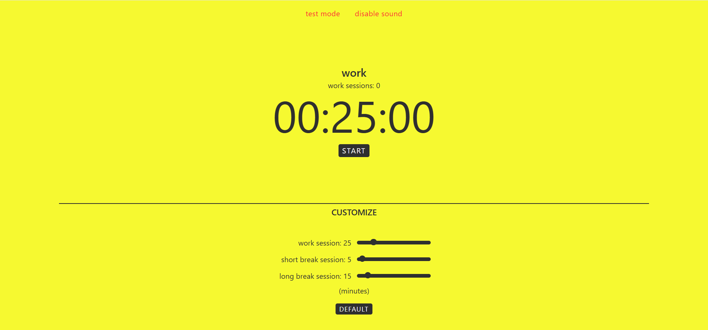

# 🍅 Pomodoro Timer

A clean and customizable Pomodoro Timer built with **Next.js**, **React**, **TypeScript**, and **Tailwind CSS**. The app helps users stay focused using the Pomodoro Technique by alternating between work sessions and scheduled breaks.

This project was built as part of the **Pomodoro Timer** project from roadmap.sh to practice React state management, timers, local storage, and modern frontend development.

## 🚀 Live Demo

**Website:** https://pomodoro-timer-lime-alpha.vercel.app/

## 📸 Preview



---

## ✨ Features

- ⏱️ Countdown timer for focused work sessions
- ☕ Automatic short and long break scheduling
- 🔄 Pause, resume, and reset controls
- 🎚️ Adjustable work, short break, and long break durations
- 💾 Preferences are saved locally using `localStorage`
- 🔔 Audio notification when a session ends
- 🧪 Test mode for quickly testing timer behavior
- 📱 Responsive interface

---

## 🛠️ Built With

- Next.js
- React
- TypeScript
- Tailwind CSS

---

## 📖 What I Learned

While building this project I practiced:

- Managing complex state with React Hooks
- Working with timers using `setTimeout`
- Persisting user preferences with `localStorage`
- Using `useEffect` correctly with dependency arrays
- Handling browser-only APIs in a Next.js application
- Structuring and refactoring React components for readability

---

## 🏃 Running Locally

Clone the repository:

```bash
git clone https://github.com/sorinnihtii/pomodoro-timer.git
```

Navigate into the project:

```bash
cd pomodoro-timer
```

Install dependencies:

```bash
npm install
```

Start the development server:

```bash
npm run dev
```

Open http://localhost:3000 in your browser.

---

## 📁 Project Inspiration

This project is based on the **Pomodoro Timer** challenge from roadmap.sh:

https://roadmap.sh/projects/pomodoro-timer

---

## 💡 Future Improvements

Some ideas I'd like to add in the future:

- Dark / light theme
- Keyboard shortcuts
- Browser notifications
- Progress ring animation
- Session statistics
- Daily focus history
- Custom notification sounds
- Accessibility improvements

---

## 📄 License

This project is open source and available under the MIT License.
